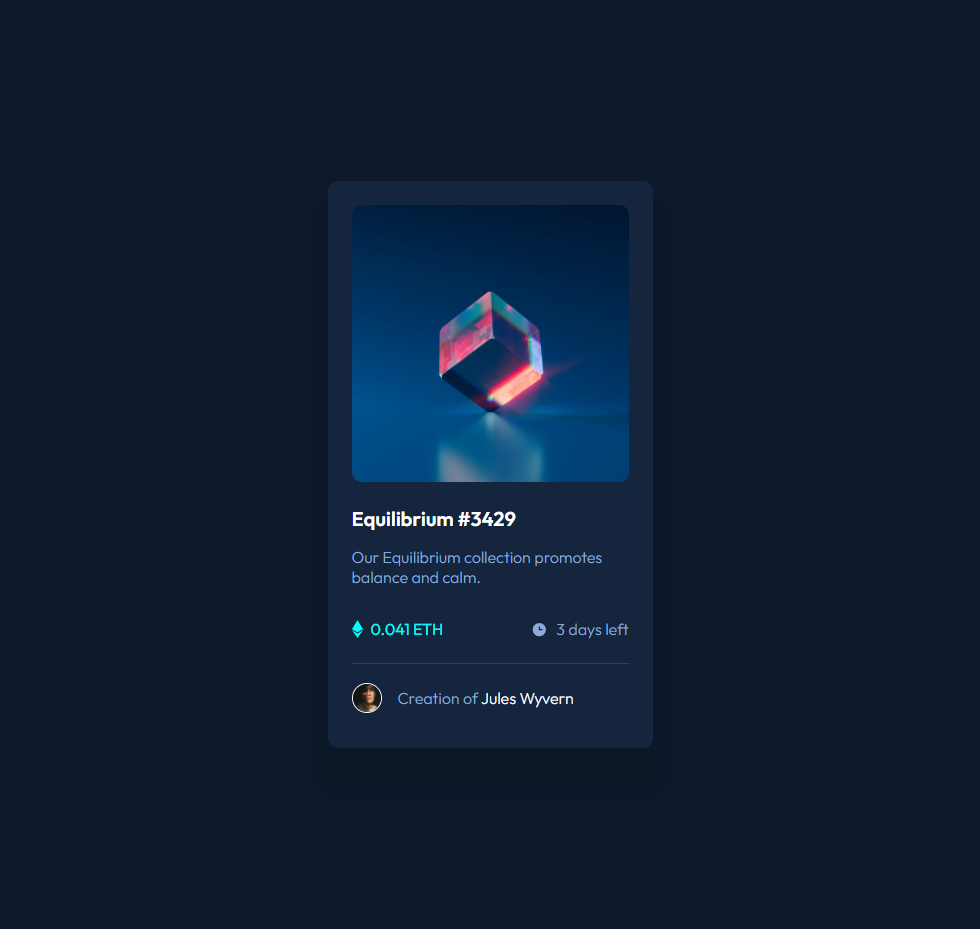

# Frontend Mentor - NFT preview card component solution

This is a solution to the [NFT preview card component challenge on Frontend Mentor](https://www.frontendmentor.io/challenges/nft-preview-card-component-SbdUL_w0U). Frontend Mentor challenges help you improve your coding skills by building realistic projects. 

## Table of contents

- [Overview](#overview)
  - [The challenge](#the-challenge)
  - [Screenshot](#screenshot)
  - [Links](#links)
- [My process](#my-process)
  - [Built with](#built-with)
  - [What I learned](#what-i-learned)
  - [Continued development](#continued-development)
  - [Useful resources](#useful-resources)
- [Author](#author)

## Overview

### The challenge

Users should be able to:

- View the optimal layout depending on their device's screen size
- See hover states for interactive elements

### Screenshot

### Links

- [Frontend Mentor Solution URL](https://www.frontendmentor.io/solutions/nft-preview-card-component-using-react-9gHPIULT8)
- [Vercel Live Site URL](https://nft-preview-card-component-umber.vercel.app/)

## My process

### Built with

- Semantic HTML5 markup
- CSS custom properties
- Flexbox
- CSS Grid
- [React](https://reactjs.org/) - JS library

### What I learned

This challenge is similar to the QR Code component except it includes more alignment and spacing challenges with the price, timeleft, and author components. Creating this component helped me start from the simplest elements and try to find connections between different blocks of html.

I was struggling with aligning the ethereum price, but it helped to start with the creator information, then imagining the ethereum and time elements as smaller versions of the creator block but with space between them.

Also, hover effects are pretty cool. I think adding small touches like transitions make the hover feel more responsive, even if it's only for a fraction of a second.

### Continued development

I want to learn more about how to structure css files because sometimes I feel like I'm having trouble looking for specific css properties affecting my code. For example, I tried to make the overlay hover the same size as the image, but the container height was always slightly larger than the image height.

In the end, I used `flex-shrink: 1` on the container to fix it, but I want a better way to structure and debug my code. Maybe adding comments would help.

### Useful resources

- [Spacing in CSS article by Ahmad Shadeed](https://ishadeed.com/article/spacing-in-css/) - Overview on spacing methods in CSS
- [CSS Tricks: Flexbox](https://css-tricks.com/snippets/css/a-guide-to-flexbox/) - Flexbox properties cheatsheet

## Author
Ian Wu

- Frontend Mentor - [@iannnop](https://www.frontendmentor.io/profile/iannnop)
- LinkedIn - [@iannnop](https://www.linkedin.com/in/iannnop/)
- Instagram - [@ian.wuu](https://www.instagram.com/ian.wuu/)
- Twitter - [@iannnop](https://www.twitter.com/iannnop)
